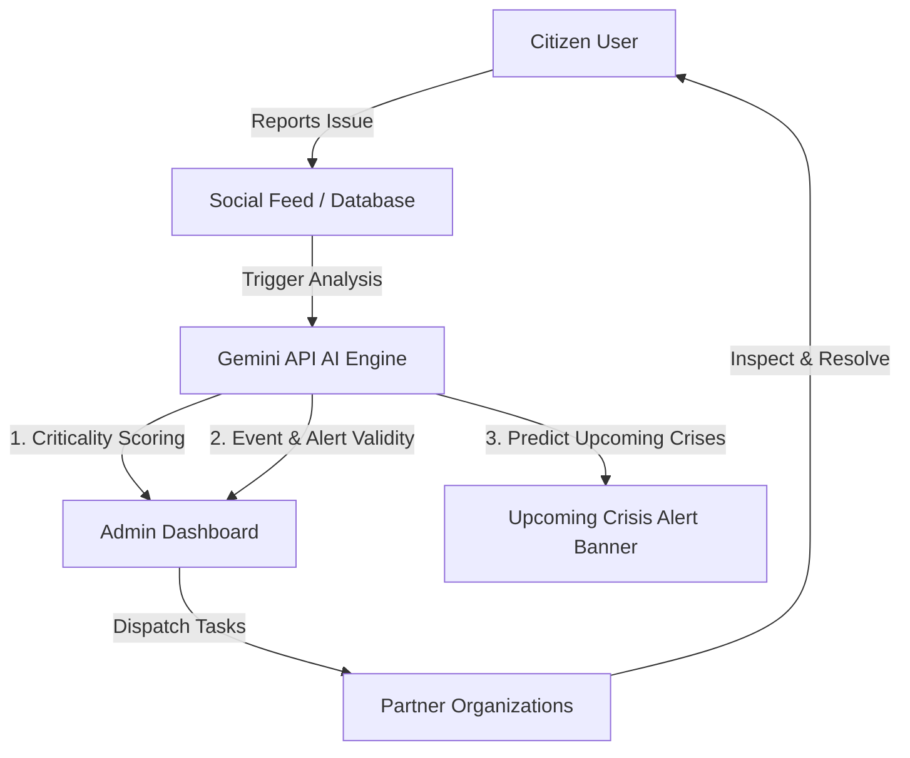

# 🌐 SupportArena

> **AI for Civic Innovation Hackathon 2026**
>
> An intelligent civic society platform empowering citizens to report local problems, propose collaborative solutions, and leverage advanced AI to validate issues and coordinate responses with community leaders and partner organizations.
>
> 

---

## 🚀 Overview

**SupportArena**  bridges the gap between citizens, local administrators (supervisors), and emergency/municipal organizations. By using the **Gemini API**, the platform transforms raw citizen reports into actionable, verified, and prioritized civic responses.

---

## 🧠 Gemini API Integration (The AI Core)

Instead of relying on rigid, rule-based keyword matching, CivicConnect leverages the cognitive power of the **Gemini API**  to drive its core features:

### 1. ⚠️ Real-Time AI Criticality Scoring

- **Dynamic Assessment:** Gemini analyzes the linguistic nuance, urgency, and hazard potential in the title and description of every citizen report.
- **Priority Classification:** Automatically tags issues into **Low**, **Medium**, **High**, or **Critical** queues, ensuring life-threatening or severe infrastructure problems (e.g., sparking wires, active flooding, gas leaks) rise to the top of the queue instantly.

### 2. 🔍 Event & Issue Validity Verification

- **Credibility Cross-Referencing:** Gemini cross-checks citizen reports with available open data sources, public weather alerts, and recent news feeds to determine report credibility.
- **Noise Reduction:** Filters out spam, redundant complaints, and false alarms, helping administrators focus on verified, legitimate incidents.

### 3. 🚨 Upcoming Crisis Alerting

- **Predictive Intelligence:** Gemini continuously reviews aggregate citizen feed trends and external hazards (e.g., severe weather warnings) to predict upcoming crises.
- **Dynamic Warning System:** Generates context-rich emergency alerts (e.g., predicting heatwaves, drainage failures before heavy rain, storm preparations) displayed site-wide on the **Upcoming Crisis Alert Banner**.

### 4. 💡 Automated Solution Recommendations

- **Synthesis:** Analyzes community comments and inline suggestions to extract and summarize the most viable solutions for administrators, facilitating swift and informed decision-making.

---

## 🛠️ Core Features

- **Social Feed:** A card-based interactive timeline where Citizens, Admins, and Organizations can post issues, reply inline, and vote on community solutions.
- **Admin Command Sidepanel:** Dedicated dashboard for community supervisors to review critical queues, inspect AI credibility ratings, and dispatch tasks to relevant organizations.
- **Organization Taskboard:** Dispatch board for registered organizations (e.g., hospitals, power companies, rescue groups) to receive alerts, inspect locations, interact with citizen posts, and mark tasks as resolved.
- **Persistent Storage:** Fully supports dual-mode storage, functioning both as an **offline-first local storage cache** and dynamically syncing with an online **Cloud Firestore Database**.

---

## 📄 License

© 2026 SupportArena. Rebuilt for AI for Civic Innovation Hackathon.
